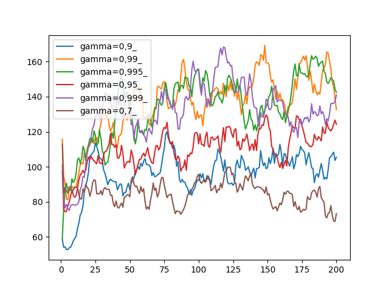

# Decay Constant (Gamma) Test

## Hypothesis
Too low a gamma leads to initial states not being able to choose the right actions since the state values get decayed too much, too high a gamma leads to the final states' values exploding.

## Test
Run cartpole on various values of gamma

## Result

It is indeed the case that higher values are necessary to train the model properly. More analysis needs to be done regarding high gammas and instability. It might be the case that due to high value states not being reached often, that for complicated environments we don't need to care much about exploding values.