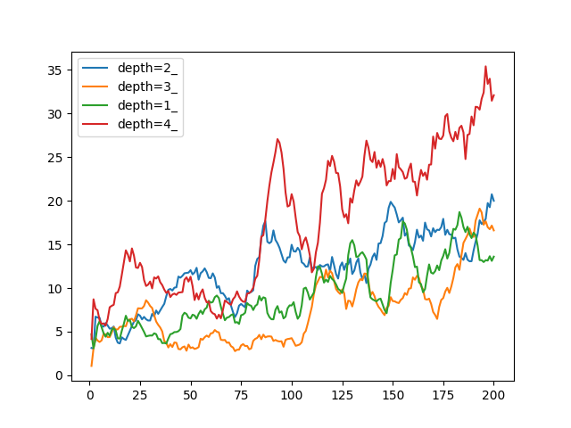
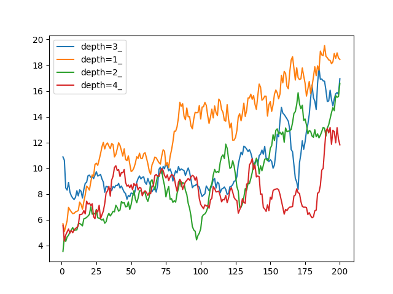

# Network Depth Test

## Hypothesis
The depth of the network affects the kind of function it can approximate. We don't know how complicated our value function is, so it is a good idea to:
1. try out various depths for a single problem, 
2. check if the optimal depth varies for problems with different levels of complexity.

## Test
1. run cartpole with various network depths
2. look at model performance across various problems

## Result

Reward against number of episodes for ```cheetah_run```. Seems like there is no difference in number of layers used. The deeper network seems to converge slower, which makes sense as there are more weights to adjust.

Reward against number of episodes for ```walker_run```. Seems like there is no difference in number of layers used. The deeper networks seem to converge slower too.
